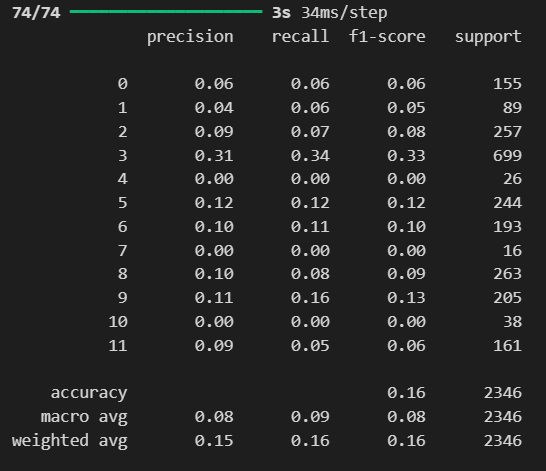
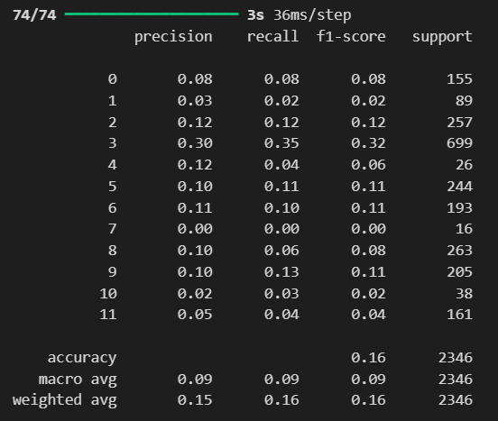
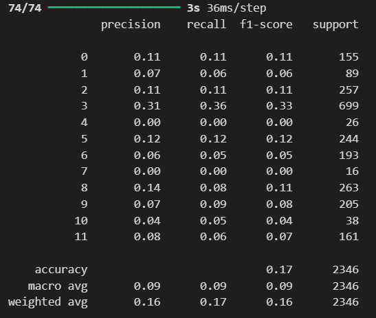

# DeepLearningCaptcha

# Models Journey
- The first model had **10** layers (**3** *Conv2D* and **3** *MaxPooling2D*, **1** *Flatten* and **2** *Dense*). After training, we saw a **validation accuracy** of 0.4224 and a **validation loss** of 4.0163, with an **accuracy** of 0.9 in training. Our model is clearly overfitted and is unable to identify the classes.

- We decided to add 3 layer at the top for data **augmentation** (1 *RandomFlip*, 1 *RandomRotation*, 1 *RandomZoom*) and 1 *Rescaling* Layer for **normalization** (from 0->255 to 0->1). We saw a change in **validation accuracy** to 0.6226 and **loss** to 1.0823, with a minimal difference with training (< 0.04). We fixed the overfitting issue and greatly improved the loss.

- Next, we added 1 *Dropout* Layer before the *Flatten* Layer. The hope was to futher lessen the overfitting. We can see that the f1-Score was improved but the effect is slight.

